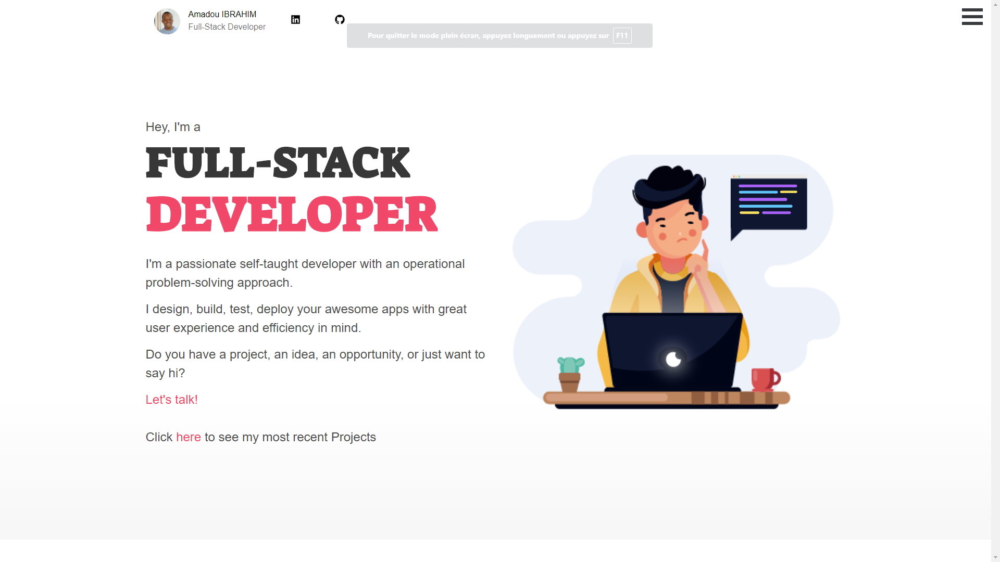

<!--
*** Thanks for checking out this README Template. If you have a suggestion that would
*** make this better, please fork the repo and create a pull request or simply open
*** an issue with the tag "enhancement".
*** Thanks again! Now go create something AMAZING! :D
-->


<!-- PROJECT SHIELDS -->
<!--
*** I'm using markdown "reference style" links for readability.
*** Reference links are enclosed in brackets [ ] instead of parentheses ( ).
*** See the bottom of this document for the declaration of the reference variables
*** for contributors-url, forks-url, etc. This is an optional, concise syntax you may use.
*** https://www.markdownguide.org/basic-syntax/#reference-style-links
-->
[![Contributors][contributors-shield]][contributors-url]
[![Forks][forks-shield]][forks-url]
[![Stargazers][stars-shield]][stars-url]
[![Issues][issues-shield]][issues-url]
[![MIT License][license-shield]][license-url]
[![LinkedIn][linkedin-shield]][linkedin-url]


<!-- PROJECT LOGO -->
<br />
<p align="center">
  <a href="https://github.com/othneildrew/Best-README-Template">
    
  </a>

  <h3 align="center">PortFolio</h3>

  <p align="center">
    Created a simple web app portfolio with clean and smooth design.
    <br />
    <a href="#about-the-project"><strong>Explore the docs »</strong></a>
    <br />
    <br />
    <a href="https://portfolio-amadou-ibrahim.herokuapp.com/" >View Demo</a>
    ·
    <a href="https://github.com/tigamadou/portfolio/issues">Report Bug</a>
    ·
    <a href="https://github.com/tigamadou/portfolio/issues">Request Feature</a>
  </p>
</p>


<!-- TABLE OF CONTENTS -->
## Table of Contents

* [About the Project](#about-the-project)
  * [Built With](#built-with)
* [Getting Started](#getting-started)
  * [Prerequisites](#prerequisites)
  * [Installation](#installation)
* [Usage](#usage)
* [Roadmap](#roadmap)
* [Contributing](#contributing)
* [License](#license)
* [Contact](#contact)
* [Acknowledgements](#acknowledgements)


<!-- ABOUT THE PROJECT -->
## About The Project



This is a PortFolio web app bootstrapped with [Create React App.](https://github.com/facebook/create-react-app)

### Built With
* [Bulma](https://getbootstrap.com)
* [ReactJs](https://github.com/facebook/react/)
* [Create React App](https://github.com/facebook/create-react-app)


<!-- GETTING STARTED -->
## Getting Started

To get a local copy up and running follow these installation steps.


### Prerequisites
This app require: nodejs. If you don't have not installed yet, do the following commands in your terminal.
* npm
```sh
npm install npm@latest -g
```

### Installation

1. Clone the repo

```sh
git clone https://github.com/tigamadou/portfolio
```

2. Browser to the cloned folder
```sh
cd portfolio
```

3. Install NPM packages
```sh
npm install / yarn install
```
4. Run the development server 
```sh
npm start 'or' yarn start
```


<!-- CONTRIBUTING -->
## Contributing

Contributions are what make the open source community such an amazing place to be learn, inspire, and create. Any contributions you make are **greatly appreciated**.

1. Fork the Project
2. Create your Feature Branch (`git checkout -b feature/AmazingFeature`)
3. Commit your Changes (`git commit -m 'Add some AmazingFeature'`)
4. Push to the Branch (`git push origin feature/AmazingFeature`)
5. Open a Pull Request


<!-- LICENSE -->
## License

Distributed under the MIT License. See `LICENSE` for more information.


<!-- CONTACT -->
## Contact
👤 **Amadou IBRAHIM**

- Github: [@genzaraki](https://github.com/genzaraki)
- Twitter: [@tigamadou](https://twitter.com/tigamadou)
- Linkedin: [Amadou IBRAHIM](https://www.linkedin.com/in/amadou-ibrahim-75769167/)

Project Link: [https://github.com/tigamadou/portfolio](https://github.com/tigamadou/portfolio)


<!-- ACKNOWLEDGEMENTS -->
## Acknowledgements
* [Microverse](https://microverse.org)
* [Bulma](https://getbootstrap.com)
* [ReactJs](https://github.com/facebook/react/)
* [Create React App](https://github.com/facebook/create-react-app)
* [Undraw](https://undraw.co/)
* [React Icons](https://react-icons.github.io/react-icons/)
* [React Router](https://reacttraining.com/react-router/web)
* [React Reveal](https://www.react-reveal.com/)
* [Eslint](https://eslint.org/)
* [Heroku](https://www.heroku.com/)


<!-- MARKDOWN LINKS & IMAGES -->
<!-- https://www.markdownguide.org/basic-syntax/#reference-style-links -->
[contributors-shield]: https://img.shields.io/github/contributors/othneildrew/Best-README-Template.svg?style=flat-square
[contributors-url]: https://github.com/othneildrew/Best-README-Template/graphs/contributors
[forks-shield]: https://img.shields.io/github/forks/othneildrew/Best-README-Template.svg?style=flat-square
[forks-url]: https://github.com/othneildrew/Best-README-Template/network/members
[stars-shield]: https://img.shields.io/github/stars/othneildrew/Best-README-Template.svg?style=flat-square
[stars-url]: https://github.com/othneildrew/Best-README-Template/stargazers
[issues-shield]: https://img.shields.io/github/issues/othneildrew/Best-README-Template.svg?style=flat-square
[issues-url]: https://github.com/othneildrew/Best-README-Template/issues
[license-shield]: https://img.shields.io/github/license/othneildrew/Best-README-Template.svg?style=flat-square
[license-url]: https://github.com/othneildrew/Best-README-Template/blob/master/LICENSE.txt
[linkedin-shield]: https://img.shields.io/badge/-LinkedIn-black.svg?style=flat-square&logo=linkedin&colorB=555
[linkedin-url]: https://linkedin.com/in/othneildrew
[product-screenshot]: images/screenshot.png
